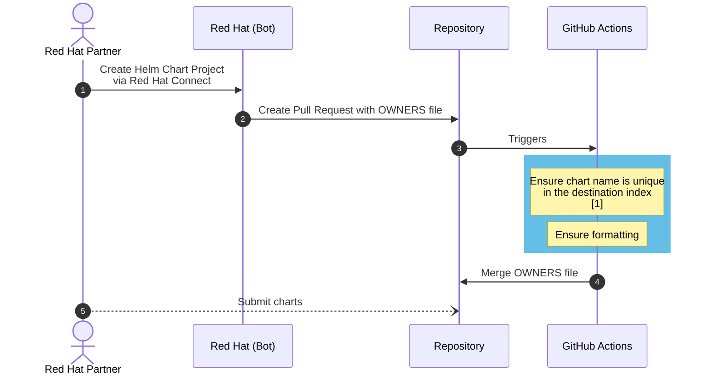
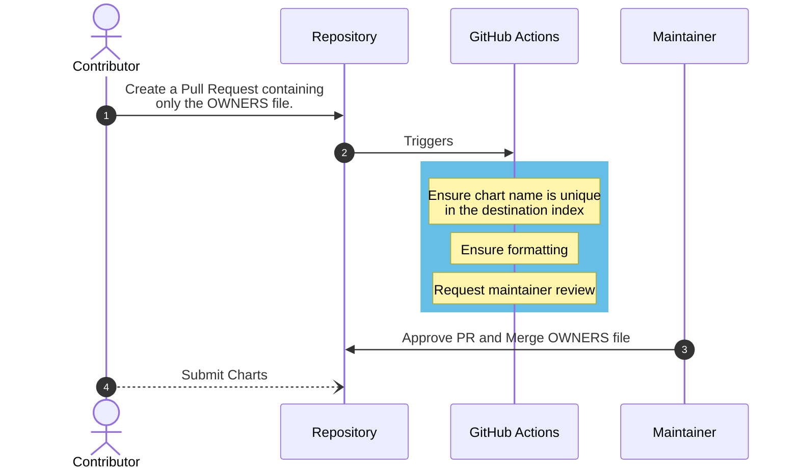
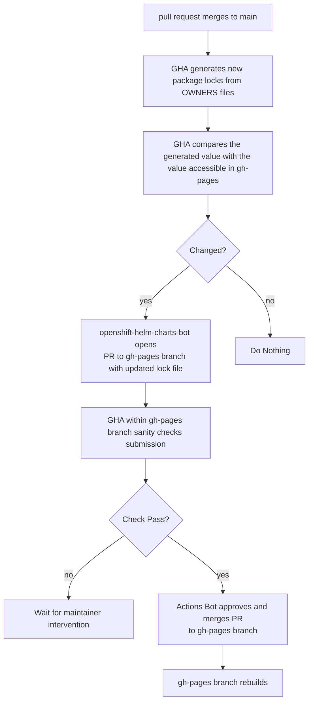

# Helm Certification Workflow Updates

This document covers a series of workflow-related updates that will go into the
repository in implementing the bug fixes related to chart dependencies.

A ky goal is to ensure that the entries in our index are keyed with the same
name as their chart. Currently a chart called `bar` from a partner called `foo`
would get indexed at `foo-bar`, with the chart name remaining `bar`. This caused
our dependency issue where users could not both dependo on a chart at its index
name without the `helm` cli complaining that the chart was missing on disk
(because no available chart pulled by `helm` would match the name declared in
the dependency).

The index will be re-keyed such that index keys match their corresponding chart
names. In doing this, we need to ensure that all chart names across our
repository are unique to avoid conflicts across contributors.

The following changes will be implemented to solve specific problems related to
this.

## Partner OWNERS file creation

The diagram below demonstrates the typical workflow a Partner follows when
creating their Helm Chart project. Most of this process is identical to what it
was previously.

The key difference is that automation (that already triggers) will include
checks to ensure that a chart name, as defined in the OWNERs file (and also the
directory structure, but that is less convenient to parse and is therefore
ignored) is not locked. This automation is indicated by step `[1]` inthe diagram
below.

"Locked" here refers to a mapping of chart names and their corresponding
contributor paths. E.g. if partner `foo` is contributing chart `bar`, their
contributor path would be `partners/foo/bar`, and so chart `bar` would be locked
to contributions from that directory structure.

An example lock file can be found [here](https://github.com/komish/openshift-helm-charts/blob/gh-pages/docs/chart-locks.json).

If a new partner registers chart `bar` within Red Hat Connect, the PR containing
the OWNERS file submitted by the Red Hat Bot would fail this check and be
unmergeable. A maintainer would need to intervene in this case.

This highlighted a key **LIMITATION**, there's currently no way to link the
locks existing in repo at project creation time. As such, a manual clean up
would need to take place. The partner would need to archive their project,
and/or choose a different chart name. There are current approaches being taken
into consideration for Partners that would prevent this conflict at project
creation time, but Community and Red Hat contributions would not be accounted
for. In the future, we may consider separate indexes such that Partners will not
be subject to this problem.

# Community/Red Hat OWNERS file creation

Red Hat and Community contributions are identical in implementation, but as
always, a project maintainer must review them before merging. 

## Package Lock Generation and Updating

Each merging OWNERS file represents a chart that will eventually go through
certification and land in our index. Once an OWNERS file lands in our
repository, the corresponding chart name will be considered locked to
contributions from that path.

This prevents a contributor "baz" from creating chart "bar" (say, at path
`community/baz/bar`) from adding charts to the entry associated with chart "bar"
if it's owned and locked to partner "foo" (at `partners/foo/bar`).

Maintaining the lock file will happen at merge time to the production
repository. Automation will review all OWNERS files found in the repository,
generate the corresponding lock file, and sanity check the contents, and merge
it into the gh-pages branch, where it will be available.

An example of this workflow can be found [here](https://github.com/komish/openshift-helm-charts/actions/runs/6396515626). Note that this was done via a manual `git push`, to avoid removing safeguards related to OWNERS file creation for Partner charts for the sake of testing.

The generated PR to update package locks looks like [this](https://github.com/komish/openshift-helm-charts/pull/5).

## Validating Chart Submissions

There are already sanity checks in place that ensure that charts being submitted are coming from a GitHub Actor (i.e. "username") that is allowed in the project's OWNERS file.

That should generally be considered sufficient, but will also consider validating that a chart submission is coming from the appropriate path, given that we have that path documented in our chart-locks.json.