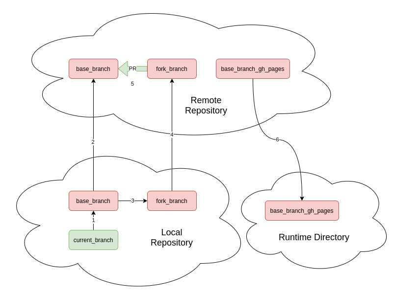

# Certification Tests for Partner and Red Hat Charts

The test suite contains multiple behavior-driven development (BDD) tests for testing existing chart submissions and the submission workflow itself.

## Procedure

Both the existing chart test and the workflow tests use the same procedure when it comes to PR submission automations:

1. Checkout the current local branch to a `test-base-branch` as the base of the PR
2. Add the `OWNERS` file of the test chart to `test-base-branch` and push to remote
3. Checkout the `test-base-branch` to `test-base-branch-pr` as the head of the PR
4. Add the test chart to the `test-base-branch-pr` and push to remote
5. Create a PR from `test-base-branch-pr` to `test-base-branch`
6. Pull index.yaml file from the remote repository and verify that entries are updated
7. Verify that a release is published on the remote repository (skipped for report only submissions)

Note that boxes with pink background are temporary branches and will be cleaned up after the test run.

## Testing Existing Chart Submissions

### Motivation

As an OpenShift Helm partner or Red Hat associate, I would like Red Hat to automatically run a certification flow for my existing charts whenever there is a significant change to the certification flow, so that I know whether my charts can be auto-certified or I need to take action to submit a new chart version.

### Process

For every new release of chart verifier or any upgrade to certification clusters, we will run a certification test for all charts that do contain a chart package. Given that the certification test passes, we will ask the chart owners for permissions through GitHub issues and update the index.yaml to indicate the certification is also valid for the new version of OpenShift or the new version of chart verifier. In the event where the test fails we will notify the owners through GitHub issues of the version change and invite them to submit a new version of the chart that meets the new certification criteria. Notification was will also be send to report only chart owners.

## Testing GitHub Workflow

### Motivation

During the development of GitHub workflow, we want to automate the process of chart submission process so that no manual forks and PR submissions are needed to test the workflow changes. Previously, all processes are done manually. To test the workflow changes in the current local branch, we need to:

1. Checkout the current local branch to a `test-base-branch` as the base of the PR
2. Add the `OWNERS` file of the test chart to `test-base-branch` and push to remote
3. Checkout the `test-base-branch` to `test-base-branch-pr` as the head of the PR
4. Add the test chart to the `test-base-branch-pr` and push to remote
5. Create a PR from `test-base-branch-pr` to `test-base-branch`
6. Workflow triggers and we check the results

The manual process is lengthy and repetitive, which leaves room for automation.

### Process

For any pull request that updates workflow under `.github/workflows`, dependency scripts under `scripts/src`, or tests under `tests/`, we first sanity checks that the submitter of the PR is listed under `approver` of `OWNERS` file and then run the automated tests. Refer to the [Procedure](#procedure) for the procedure of an automated PR submission and tests. All local and remote test branches as well as the releases are cleaned up after the tests are finished.
